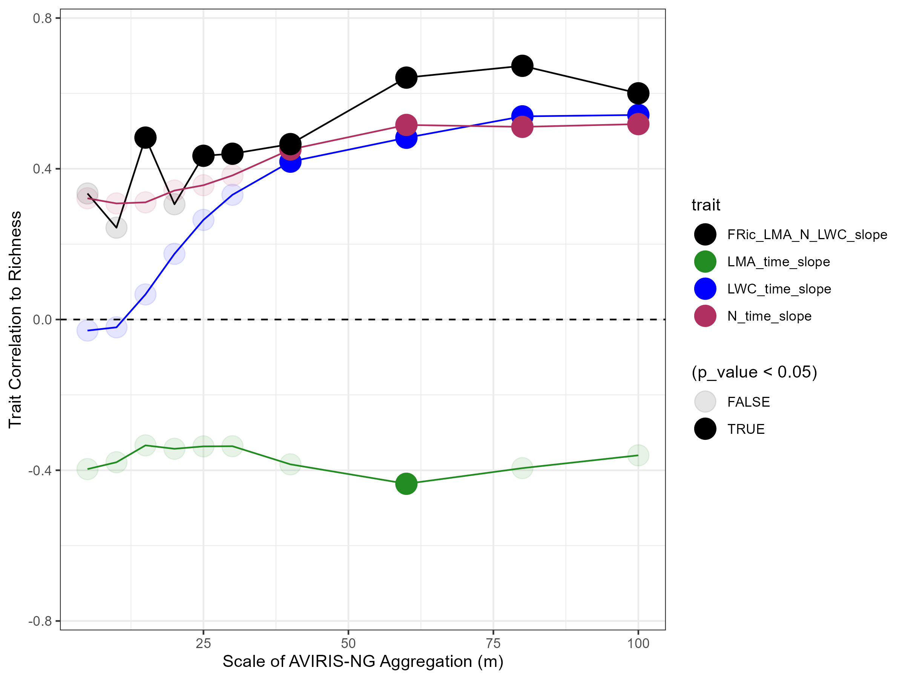
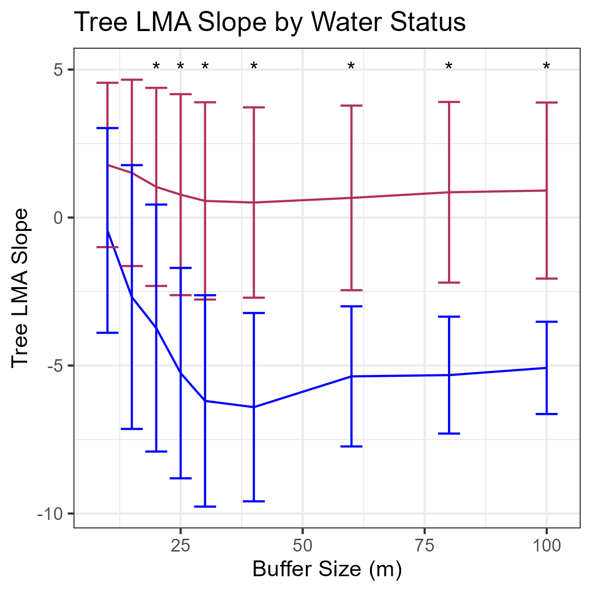
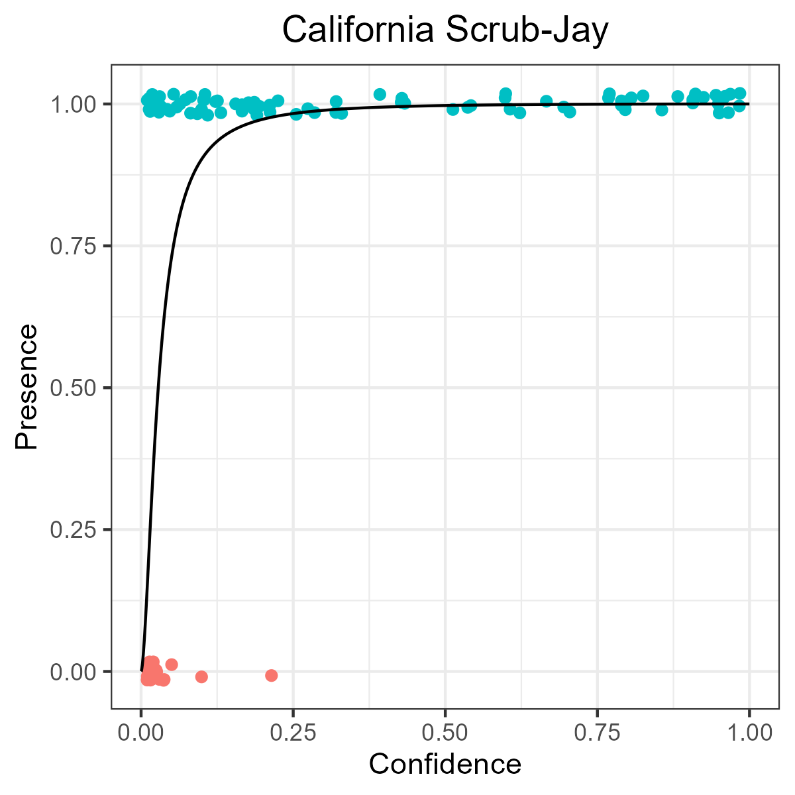

# AGU 2025 - B33H-1985

## SHIFTing from Flora to Fauna: Combining Bioacoustics and Imaging Spectroscopy to Track Seasonal and Spatial Patterns of Riparian Animal Vocal Activity

<embed src="2025_AGU_Birds.pdf" type="application/pdf" width="100%" height="800px" />

With any questions, please contact Conor McMahon: conormcmahon @ ucsb.edu

# Data Sources

Plant traits data were developed during and following the 2022 Surface Biology and Geology HIgh Frequency Timeseries (SHIFT) project. All traits data are available online at: 

Zheng, T., N. Queally, C. Ade, P.G. Brodrick, K.D. Chadwick, and P.A. Townsend. 2025. SHIFT: AVIRIS-NG Derived Plant Functional Trait Mosaics. ORNL DAAC, Oak Ridge, Tennessee, USA. 
[SHIFT Plant Traits](https://daac.ornl.gov/cgi-bin/dsviewer.pl?ds_id=2453)

More documentation is available from the manuscript:

Chadwick, K. D. et al., 2025. Unlocking ecological insights from sub-seasonal visible-to-shortwave infrared imaging spectroscopy: The SHIFT campaign. ECOSPHERE. 16 (3). [SHIFT Manuscripts](https://doi.org/10.1002/ecs2.70194)

# Example Photos

Additional versions are available for most plots shown on the primary poster. These primarily show greater levels of detail for species-trait or other response-driver relationships which did not fit on the poster but might still be interesting to some viewers. For these, see the list below. Each link is to a page containing a folder of images, after an example. **Click the images to see more representative examples.** For additional context, see the poster. 

###  Matrix Plots of Species Relationships to Habitat Across Spatial Scales

<embed src="species_composite_matrix_plots/test_species_regression_raster_60.pdf" type="application/pdf" width="100%" height="800px" />

###  Bird Richness Relationships to Plant Traits and Other Drivers

###  Individual Bird Species Relationships to Plant Traits

###  Individual Bird Species Relationships to Plant Trait Functional Richness

###  Individual Bird Species Relationships to Tree Cover

###  Individual Bird Species Relationships to Surface Water

###  Individual Bird Species Relationships to Surface Water

 
